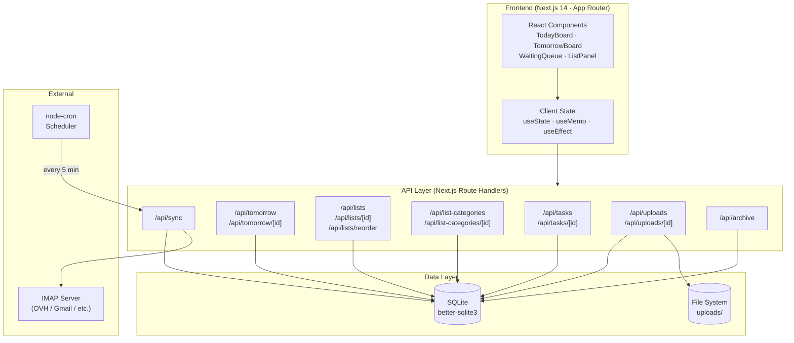
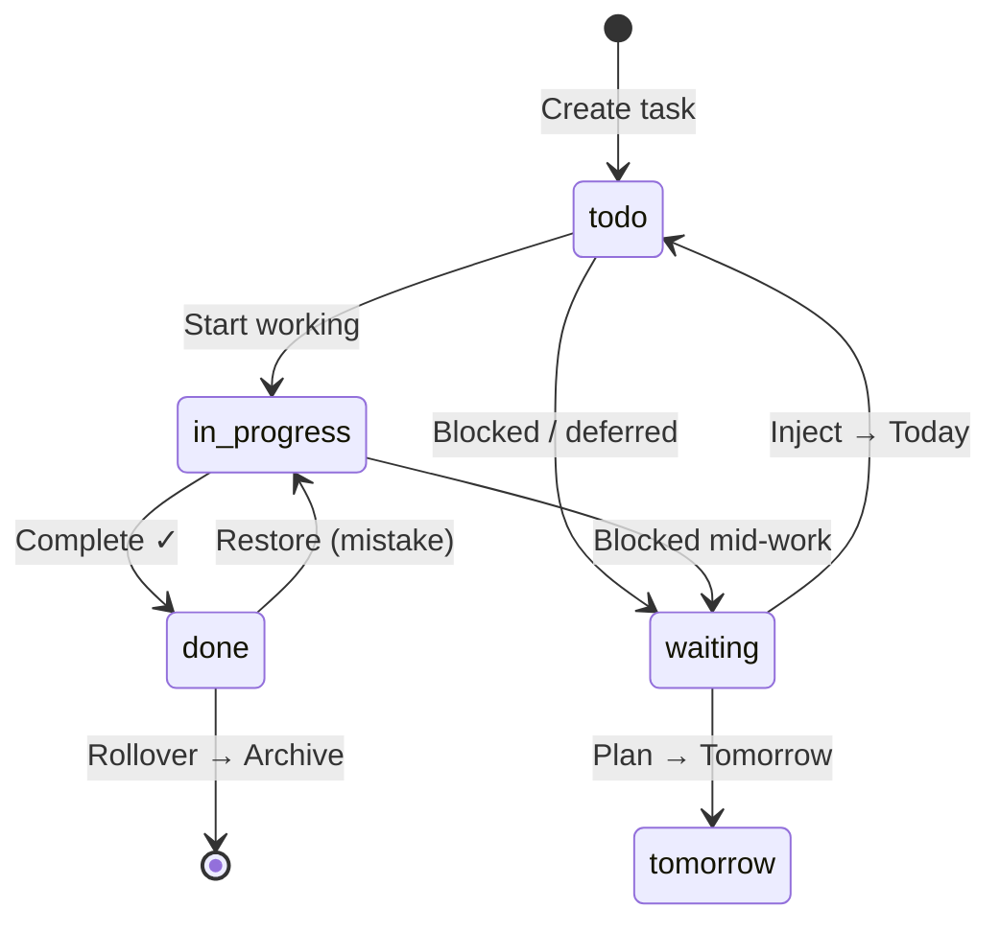
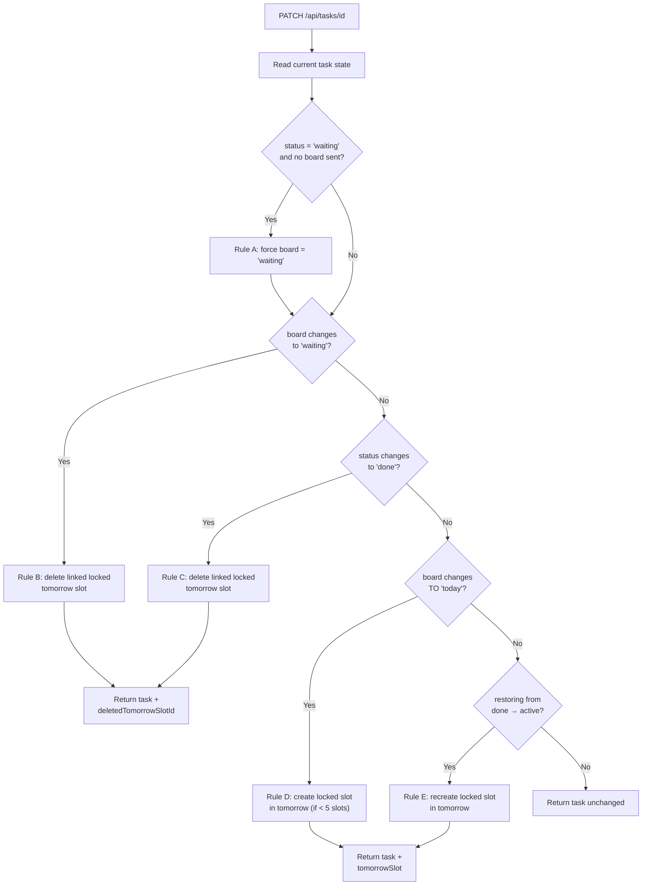
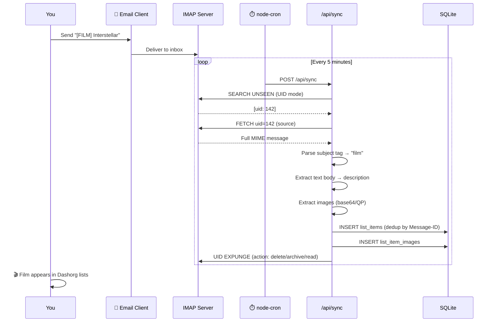
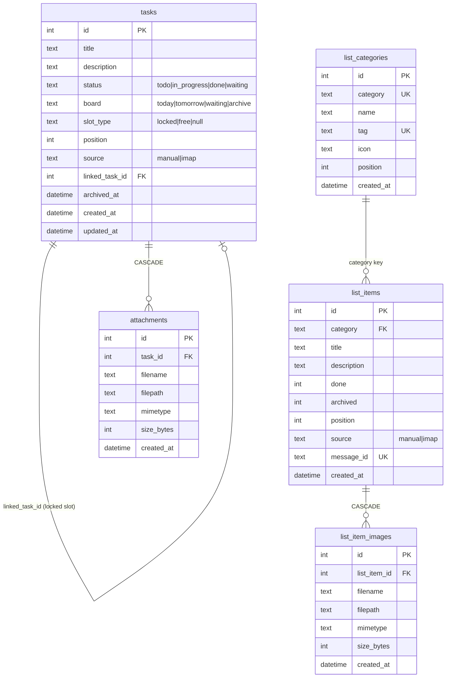

<div align="center">

# 🗂️ Dashorg

**A personal dashboard built around one radical constraint: 5 tasks per day.**

[](https://nextjs.org)
[](https://www.typescriptlang.org)
[](https://github.com/WiseLibs/better-sqlite3)
[](https://tailwindcss.com)

</div>

---

## The Problem with Most To-Do Apps

Most productivity tools let you add unlimited tasks. That sounds helpful — until you end up with a list of 87 items and a growing sense of dread every morning.

The truth is: **you can realistically accomplish 3 to 5 meaningful tasks in a day.** Everything beyond that is wishful thinking masquerading as planning.

> *"It is not enough to be busy. The question is: what are we busy about?"*
> — Henry David Thoreau

---

## The Philosophy: 5 Tasks a Day, Nothing More

Dashorg is built on a synthesis of three battle-tested productivity methods:

### 📌 The Ivy Lee Method (1918)
Developed by productivity consultant Ivy Lee for the Bethlehem Steel Corporation, this 100-year-old ritual remains one of the most effective daily systems ever designed:

1. At the end of each workday, write down the **6 most important things** you need to accomplish tomorrow
2. **Rank them** in order of true importance — not urgency
3. The next day, work through the list **in order**, finishing each task before starting the next
4. Move unfinished items to tomorrow's list and repeat

The key insight: **decision fatigue kills productivity.** By planning the night before, you eliminate the morning paralysis of figuring out what to do first.

### 🎯 The MIT Method (Most Important Tasks)
Popularized by Leo Babauta of Zen Habits, the MIT approach asks a simple question each morning:

> *"If I could only accomplish one thing today, what would move the needle most?"*

You identify **2–3 MITs** and protect time for them before anything else. These are not just important tasks — they are **force multipliers** that make everything else easier or irrelevant.

### 🔄 Personal Kanban
Jim Benson's Personal Kanban adds visual flow and a critical rule: **limit your Work In Progress (WiP).**

The two fundamental rules:
1. **Visualize your work** — if it's not visible, it doesn't exist
2. **Limit WiP** — doing less means finishing more

These three methods share a single truth: **constraints breed clarity.** Dashorg enforces that clarity at the system level with a hard limit of **5 slots per day**.

---

## How Dashorg Works

```
┌─────────────────────────────────────────────────────────────────────┐
│                         DAILY RHYTHM                                │
│                                                                     │
│   EVENING              MORNING              DURING THE DAY         │
│                                                                     │
│  ┌──────────┐         ┌──────────┐          ┌──────────────────┐   │
│  │ Plan     │ rollover│ Execute  │  review  │ Capture & Sort   │   │
│  │ Tomorrow │────────▶│  Today   │─────────▶│ Waiting / Lists  │   │
│  │ (5 slots)│         │ (5 slots)│          │                  │   │
│  └──────────┘         └──────────┘          └──────────────────┘   │
│                                                                     │
│   Lock tomorrow's      Your daily             Anything that        │
│   slots with intent    battlefield            can't happen today   │
└─────────────────────────────────────────────────────────────────────┘
```

### The Four Boards

| Board | Purpose | Capacity |
|---|---|---|
| **Today** | Active battlefield — what you're doing now | 5 slots |
| **Tomorrow** | Intention for the next day, planned tonight | 5 slots |
| **Waiting** | Blocked or deferred tasks — out of sight, not forgotten | Unlimited |
| **Archive** | Completed tasks rolled over automatically | Unlimited |

### Slot Types on Tomorrow

Tomorrow's board has two kinds of slots:

- **🔒 Locked** — automatically created when you work on a task today. It carries over to tomorrow, greyed out, as a reminder of your commitment.
- **📋 Free** — manually added slots for new intentions.

This mirrors the Ivy Lee Method's rollover mechanic: unfinished tasks don't disappear, they demand a conscious decision tomorrow.

---

## System Architecture



---

## Task Lifecycle



### Business Rules on PATCH `/api/tasks/[id]`



---

## Email-to-List: Capture Anywhere

One of Dashorg's most powerful features: **send an email to capture an idea directly into your lists**.



### Tag Mapping (fully configurable)

| Email subject prefix | List category | Configurable? |
|---|---|---|
| `[FILM] Interstellar` | 🎬 Films | ✅ Create custom tags |
| `[LIVRE] Atomic Habits` | 📚 Livres | ✅ |
| `[RESTAURANT] Septime` | 🍽️ Restaurants | ✅ |
| `[NOTE] Remember this` | 📝 Notes | ✅ |
| `[SERIE] Severance` | 📺 Your custom list | ✅ |

---

## Data Model



---

## Features at a Glance

### Task Management
- **5-slot constraint** enforced on Today and Tomorrow boards
- **Inline editing** — click to edit title and description directly in the board
- **Status flow** — `todo` → `in_progress` → `done` with automatic tomorrow slot management
- **Waiting queue** — inject back to Today (creates locked tomorrow slot) or directly to Tomorrow
- **Archive panel** — automatic rollover, filterable by date range
- **Drag-and-drop** reordering on list items

### Smart Tomorrow Planning
- 🔒 **Locked slots** auto-generated when you work on a task today
- 📋 **Free slots** manually added for new tomorrow intentions
- Edit title and description directly on tomorrow cards
- Send a free slot back to waiting with one click

### Personal Lists
- **Unlimited custom lists** — create with any name, emoji (full picker), and IMAP tag
- **Real-time drag & drop** to reorder items by priority
- **Double-click to edit** title and description inline
- **Archive** completed items (or delete permanently)
- **Image support** — IMAP attachments + inline images saved and displayed as thumbnails
- **Lightbox** — click any thumbnail for full-size view
- **Clickable links** — URLs in descriptions auto-detected and made clickable

### Email Capture (IMAP)
- Auto-polling every 5 minutes
- **Deduplication** via `Message-ID` — emails are never imported twice
- **Post-processing action**: delete, archive, or mark-as-read after import
- **Image extraction** from MIME multipart (base64 and quoted-printable)
- **Full text body** becomes the item description

### UI/UX
- 🌙 **Dark / Light mode** toggle
- Manual sync button with live feedback
- Info popup (ℹ) with real-time tag search
- Emoji picker for list icons (emoji-mart)
- Fully responsive layout

---

## Project Structure

```
dashorg/
├── app/
│   ├── api/
│   │   ├── archive/            # GET archived tasks
│   │   ├── list-categories/    # GET + POST categories
│   │   │   └── [id]/           # PATCH (rename/icon) + DELETE
│   │   ├── lists/              # GET + POST list items
│   │   │   ├── [id]/           # PATCH + DELETE item
│   │   │   │   └── images/[imageId]/  # GET (serve binary) + DELETE
│   │   │   └── reorder/        # POST bulk position update
│   │   ├── sync/               # POST trigger IMAP poll
│   │   ├── tasks/              # GET + POST tasks
│   │   │   └── [id]/           # PATCH (with business rules) + DELETE
│   │   ├── tomorrow/           # GET + POST tomorrow slots
│   │   │   └── [id]/           # PATCH + DELETE slot
│   │   └── uploads/            # POST file upload
│   │       └── [id]/           # GET (serve binary) + DELETE
│   ├── page.tsx                # Root page — state orchestration
│   └── layout.tsx
│
├── components/
│   ├── TodayBoard.tsx          # 5-slot today board with status controls
│   ├── TomorrowBoard.tsx       # 5-slot planning board with lock/free slots
│   ├── WaitingQueue.tsx        # Deferred tasks with inject buttons
│   ├── ArchivePanel.tsx        # Completed tasks archive
│   ├── ListPanel.tsx           # Personal lists with drag & drop
│   ├── TaskDetail.tsx          # Slide-in detail panel with file upload
│   ├── EmojiPickerButton.tsx   # Emoji picker (emoji-mart, dynamic import)
│   └── LinkedText.tsx          # Auto-linkify URLs in text
│
├── lib/
│   ├── db.ts                   # SQLite singleton + schema + migrations
│   ├── imap.ts                 # IMAP polling, MIME parsing, image extraction
│   ├── logger.ts               # Structured logger [LEVEL] YYYY-MM-DD context msg
│   └── types.ts                # Shared TypeScript interfaces
│
├── data/                       # SQLite database (gitignored)
├── uploads/                    # Uploaded files (gitignored)
└── .env.local                  # Your config (gitignored)
```

---

## Getting Started

### Prerequisites

- Node.js 18+
- An IMAP-enabled email account (Gmail, OVH, Infomaniak, Outlook…)

### Installation

```bash
git clone https://github.com/e-lab-aure/tool_Dashorg.git
cd tool_Dashorg
npm install
```

### Configuration

Create a `.env.local` file at the root:

```env
# ─── IMAP ──────────────────────────────────────────────────────────
IMAP_HOST=ssl0.ovh.net
IMAP_PORT=993
IMAP_USER=your@email.com
IMAP_PASSWORD=your_password
IMAP_TLS=true

# What happens to an email after it's imported
# read    → mark as read (flag \Seen)
# delete  → permanently remove from inbox
# archive → move to IMAP_ARCHIVE_FOLDER
IMAP_PROCESSED_ACTION=delete
IMAP_ARCHIVE_FOLDER=Archive

# ─── APP ───────────────────────────────────────────────────────────
NEXT_PUBLIC_APP_TITLE=Dashorg
```

### Run

```bash
npm run dev
```

Open [http://localhost:3000](http://localhost:3000).

The SQLite database and all tables are created automatically on first run. The four default list categories (Films, Livres, Restaurants, Notes) are seeded automatically.

---

## Database Migrations

Dashorg uses a **safe migration pattern**: each `ALTER TABLE` is wrapped in a `try/catch` because SQLite doesn't support `ADD COLUMN IF NOT EXISTS`. Migrations run automatically at startup via `applyMigrations()` in `lib/db.ts`.

```typescript
// Pattern used for every migration
try {
  db.exec('ALTER TABLE tasks ADD COLUMN new_field TEXT');
} catch {
  // Column already exists — migration skipped silently
}
```

This makes the app safe to restart at any time without manual migration steps.

---

## IMAP Processing Pipeline

```
Email arrives in inbox
        │
        ▼
┌───────────────────┐
│  SEARCH UNSEEN    │  ← UID mode (stable across sessions)
│  (uid: true)      │
└────────┬──────────┘
         │ [uid1, uid2, ...]
         ▼
┌───────────────────┐
│  FETCH messages   │  ← Full source (envelope + raw MIME)
│  Phase 1: collect │    No write operations during FETCH
└────────┬──────────┘
         │ collected[]
         ▼
┌───────────────────┐
│  Phase 2: process │  ← Parse subject tag, check dedup (Message-ID),
│  (DB inserts)     │    extract text body, save images to disk
└────────┬──────────┘
         │
         ▼
┌───────────────────┐
│  Phase 3: action  │  ← delete / archive / read
│  (after FETCH)    │    Safe: FETCH is fully complete
└───────────────────┘
```

> **Why phases?** Calling `messageDelete` or `messageFlagsAdd` while a `FETCH` iterator is still active can cause protocol errors on certain servers (observed on OVH). Separating collection from writing guarantees compatibility.

---

## Contributing

This is a personal productivity tool — but if you find it useful, feel free to fork it and adapt it to your workflow.

Issues and pull requests welcome.

---

## License

MIT — do whatever you want with it.

---

<div align="center">

*Built with the belief that less is more, and that a system you trust is worth a hundred features you don't use.*

</div>
